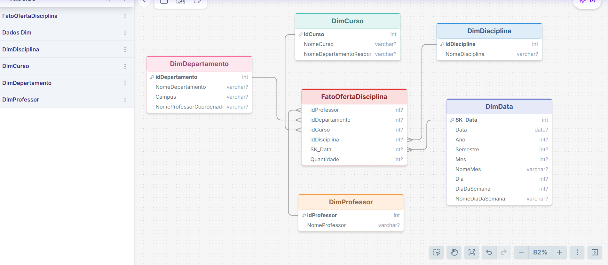

# Modelagem Dimensional — Análise de Professores

Projeto desenvolvido como parte do desafio de **Modelagem Dimensional**, com foco na construção de um **Star Schema (Esquema Estrela)** a partir de um modelo relacional.

## Objetivo

Criar um modelo dimensional para análise dos dados dos professores, considerando informações relacionadas às disciplinas ministradas, cursos, departamentos e período de oferta.

## O que foi desenvolvido

Foi construído um esquema estrela com:

- Tabela fato para o contexto de análise dos professores
- Dimensão Professor
- Dimensão Disciplina
- Dimensão Curso
- Dimensão Departamento
- Dimensão Data

A modelagem considera o **professor como objeto principal de análise** e estabelece a granularidade necessária para relacionar professores, disciplinas, cursos, departamentos e datas.

## Conceitos utilizados

- Modelagem dimensional
- Star Schema
- Tabela fato
- Tabelas dimensão
- Granularidade
- Chaves substitutas
- Dimensão de datas

## Diagrama

## Arquivos do projeto

- `imagens/esquema-estrela-analise-professores.png`

## Referência do desafio

Desafio de **Modelagem Dimensional**, com foco na criação de um esquema estrela para análise dos dados dos professores.
