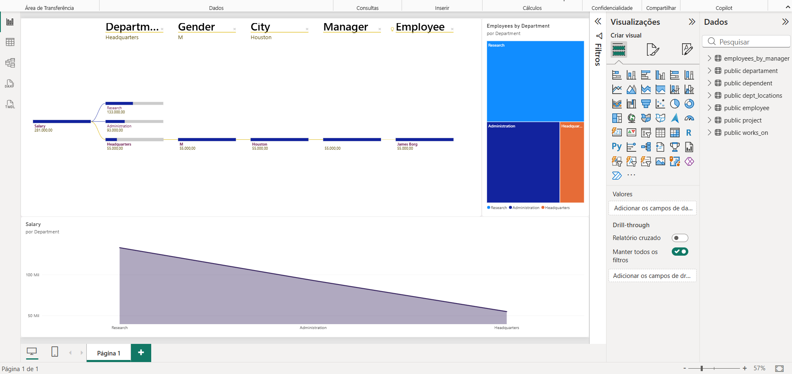

# 📊 Company Workforce Analysis --- Power BI + PostgreSQL

Projeto de análise de dados desenvolvido como parte do desafio
**Processando e Transformando Dados com Power BI**, com foco na criação
de uma base relacional, integração com o Power BI, transformação dos
dados no Power Query e construção de um relatório para análise da
estrutura organizacional da empresa.

> O desafio original propõe a utilização de **MySQL no Microsoft
> Azure**.\
> Nesta implementação, o ambiente foi adaptado para **PostgreSQL 16
> executado localmente no WSL2**, mantendo os objetivos de modelagem,
> integração, transformação e análise dos dados.

------------------------------------------------------------------------

## 🎯 Objetivo

Construir um fluxo de dados completo, partindo de uma base relacional
até sua utilização em um relatório no Power BI.

O projeto envolve:

-   adaptação dos scripts SQL para PostgreSQL;
-   criação da estrutura relacional do banco `company`;
-   carga dos dados;
-   conexão entre PostgreSQL e Power BI;
-   transformação e preparação dos dados com Power Query;
-   análise de relacionamentos entre funcionários, gestores e
    departamentos;
-   construção de um relatório para visualização das informações.

## 🏗️ Arquitetura da solução

``` text
Scripts SQL
    ↓
PostgreSQL 16
    ↓
WSL2
    ↓
Power BI Desktop (Windows)
    ↓
Power Query
    ↓
Transformação dos dados
    ↓
Modelo analítico
    ↓
Relatório Power BI
```

O PostgreSQL foi executado no ambiente Linux através do WSL2, enquanto o
Power BI Desktop foi executado no Windows. A conexão entre os dois
ambientes permitiu que o Power BI consultasse o banco PostgreSQL
utilizado no projeto.

## 🗄️ Banco de dados

O banco `company` foi estruturado com seis tabelas:

  -----------------------------------------------------------------------
  Tabela                              Finalidade
  ----------------------------------- -----------------------------------
  `employee`                          Funcionários e hierarquia de
                                      supervisão

  `departament`                       Departamentos e seus gestores

  `dept_locations`                    Localizações dos departamentos

  `project`                           Projetos da empresa

  `works_on`                          Relação entre funcionários,
                                      projetos e horas trabalhadas

  `dependent`                         Dependentes dos funcionários
  -----------------------------------------------------------------------

O modelo utiliza Primary Keys, Foreign Keys, chaves compostas,
restrições `CHECK`, restrições `UNIQUE`, integridade referencial e
relacionamento recursivo entre funcionário e supervisor.

### Scripts

-   [`01_create_company_postgresql.sql`](database/01_create_company_postgresql.sql)
    --- criação da estrutura do banco.
-   [`02_insert_company_postgresql.sql`](database/02_insert_company_postgresql.sql)
    --- carga dos dados.

## 🔄 Transformação dos dados

Após a conexão do PostgreSQL com o Power BI, os dados foram preparados
utilizando o **Power Query**.

### Tratamento de endereço

O campo original de endereço possuía informações concatenadas, como
`731-Fondren-Houston-TX`. O conteúdo foi separado em `address_number`,
`street`, `city` e `state`, considerando também nomes compostos de rua.

### Funcionários e departamentos

Foi realizada uma mesclagem entre funcionários e departamentos
utilizando o número do departamento, associando cada funcionário ao
respectivo departamento.

### Hierarquia funcionário → gestor

A tabela de funcionários contém a referência para o supervisor através
de `super_ssn`. Foi realizada uma autojunção para identificar o gestor
de cada funcionário e foram criados os campos `employee_name` e
`manager_name`.

O funcionário no topo da hierarquia permanece sem gestor, preservando o
valor nulo existente na origem.

### Departamentos e localizações

As informações de departamentos e suas localizações foram combinadas
para associar **Department** e **Location**.

### Funcionários por gestor

Foi criada uma consulta derivada para contabilizar a quantidade de
funcionários associados a cada gestor.

### Limpeza do modelo

Colunas auxiliares e estruturas automáticas de relacionamento
desnecessárias para a análise final foram removidas.

## 📊 Relatório

### Company Workforce Overview



A página permite analisar distribuição salarial por departamento,
quantidade de funcionários por departamento, hierarquia organizacional,
localização dos funcionários e distribuição por gênero.

O relatório utiliza recursos como **Decomposition Tree**, **Treemap** e
visualização de salários por departamento.

## 🧰 Tecnologias utilizadas

-   Power BI Desktop
-   Power Query
-   PostgreSQL 16
-   SQL
-   WSL2
-   Windows
-   Git
-   GitHub

## 📁 Estrutura do projeto

``` text
power-bi-postgresql-company-analysis/
├── README.md
├── database/
│   ├── 01_create_company_postgresql.sql
│   └── 02_insert_company_postgresql.sql
├── images/
│   └── company-workforce-overview.png
└── project/
    └── desafio-company-postgresql-powerbi.pbix
```

## ▶️ Arquivo Power BI

[`desafio-company-postgresql-powerbi.pbix`](project/desafio-company-postgresql-powerbi.pbix)

## 💡 Principais aprendizados

Este projeto permitiu praticar o fluxo:

**Banco de dados → integração → transformação → modelagem →
visualização.**

Além do Power BI, o desafio proporcionou experiência prática com
adaptação de scripts entre SGBDs, criação de banco relacional,
PostgreSQL, integração entre Linux e Windows, Power Query, mesclagens,
valores nulos, hierarquias organizacionais, preparação de dados para
análise e documentação técnica.

## 📚 Contexto acadêmico

Projeto desenvolvido durante a formação **Primeiros Passos em Power
BI**, como implementação do desafio **Processando e Transformando Dados
com Power BI**.

A infraestrutura original proposta utilizava MySQL no Azure. Nesta
implementação, o ambiente foi adaptado para PostgreSQL 16 no WSL2,
permitindo executar localmente o fluxo de criação, carga, integração,
transformação e análise dos dados.

## 👤 Autor

**Alexandro Teixeira**

Projeto desenvolvido para fins de estudo e construção de portfólio em
Análise de Dados e Business Intelligence.
