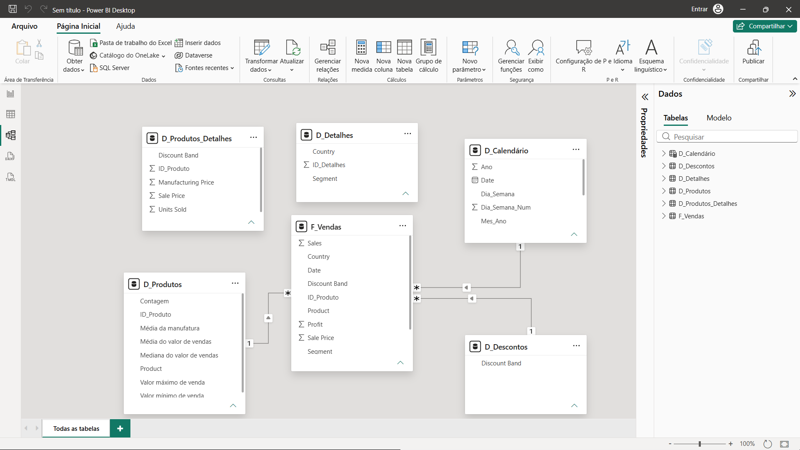

# Modelagem Dimensional (Star Schema) e DAX no Power BI

Projeto prático de engenharia de dados e modelagem dimensional no Power BI a partir da base transacional bruta `Financial Sample`. O objetivo central foi transformar uma estrutura plana desnormalizada em uma arquitetura em **Esquema em Estrela (Star Schema)** com integridade referencial, eliminação de redundâncias e otimização do fluxo analítico.

---

## Diagrama do Modelo (Star Schema)



---

## Camada de Engenharia e ETL (Power Query)

- **financials_origem (Staging)**: Cópia da base original mantida com a opção *Habilitar Carga* desmarcada, atuando como staging e tabela de segurança sem alocar espaço na memória do modelo tabular.
- **F_Vendas (Fato Central)**:
  - Criação da *Surrogate Key* (`SK_ID`) sequencial a partir de 0 via coluna de índice.
  - Criação de chave de ligação (`ID_Produto`) via regra condicional mapeando de 0 a 5 os produtos.
  - Seleção focada estritamente nas métricas financeiras (`Units Sold`, `Sale Price`, `Profit`, `Sales`) e chaves dimensionais contextuais (`Date`, `ID_Produto`, `Discount Band`, `Segment`, `Country`).
- **D_Produtos**:
  - Tabela dimensional construída via agrupamento (`Group By`), agregando total de unidades vendidas, preços médios, mínimos, máximos e mediana de venda, além do custo de manufatura médio associado a cada `ID_Produto`.
- **D_Descontos**:
  - Tabela dimensional contendo faixas únicas de desconto (`Discount Band`), normalizadas para garantir cardinalidade $1 \rightarrow *$ com filtro unidirecional em direção à fato.
- **D_Produtos_Detalhes & D_Detalhes**:
  - Tabelas dimensionais mantidas no projeto para consultas granulares de regras de negócio específicas, desacopladas para preservar o núcleo estrela centralizado.

---

## Dimensão Temporal Dinâmica (DAX)

Tabela `D_Calendário` gerada via código DAX para cobrir o intervalo de datas do modelo:

```dax
D_Calendário = 
VAR DataMinima = MIN(F_Vendas[Date])
VAR DataMaxima = MAX(F_Vendas[Date])
RETURN
    ADDCOLUMNS(
        CALENDAR(DataMinima, DataMaxima),
        "Ano", YEAR([Date]),
        "Mes_Num", MONTH([Date]),
        "Mes_Nome", FORMAT([Date], "MMMM"),
        "Mes_Ano", FORMAT([Date], "mmm/yyyy"),
        "Trimestre", "T" & FORMAT([Date], "Q"),
        "Trimestre_Ano", "T" & FORMAT([Date], "Q") & "/" & YEAR([Date]),
        "Dia_Semana", FORMAT([Date], "dddd"),
        "Dia_Semana_Num", WEEKDAY([Date], 2)
    )
